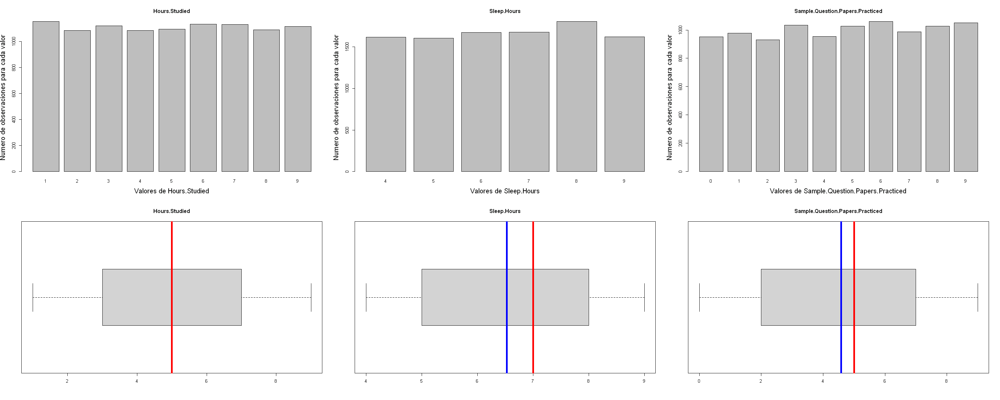
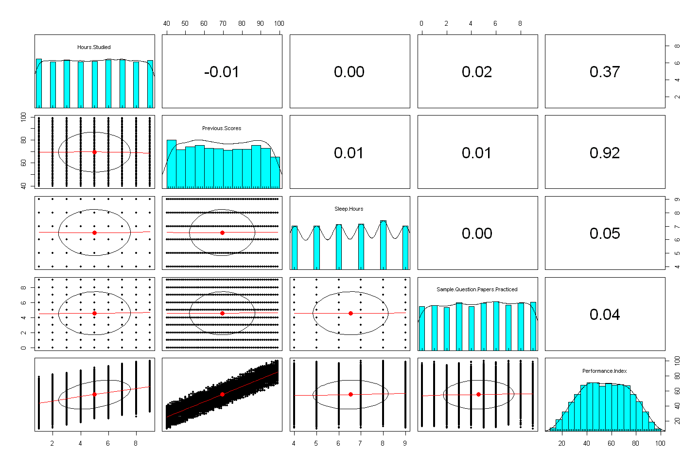

# Student Performance

* Analisis descriptivo del dataset [Student performance](https://www.kaggle.com/datasets/nikhil7280/student-performance-multiple-linear-regression).
* El objetivo sera realizar una regresion lineal multiple, tomando como variable respuesta performance index.

# Student Performance
 |  |  |
 |-------------------------------|------------------------------|
## Descripion

Analisis del rendimiento academico de un conjunto de estudiantes.
Aunque no se especifica en Kaggle, es un conjunto de datos sintetico generado con fines educativos

## Contenido del repositorio

* Student_Performance_Analisis.ipynb: Notebook que contiene el analisis completo de los datos
* Student_Performance.csv: Conjunto de datos
* README.md: Este archivo
* fotos: Carpeta que contiene las fotos del README.md

## Requisitos

Uso de algun visor de **.ipynb**

## Fuente de datos
* Dataset:  ['Student_Performance.csv'](https://www.kaggle.com/datasets/nikhil7280/student-performance-multiple-linear-regression) 
* Autor: [Nikhil Narayan](https://www.kaggle.com/nikhil7280)
* Licencia: Anyone is free to share and use the data

> [!NOTE]
Se busca conseguir en un final un modelo de regresion lineal multiple